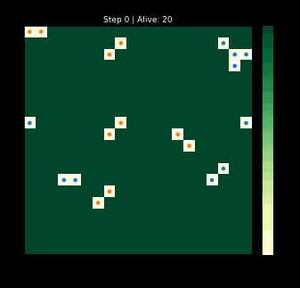
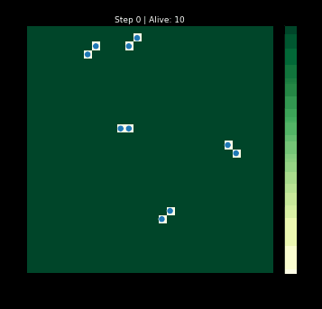
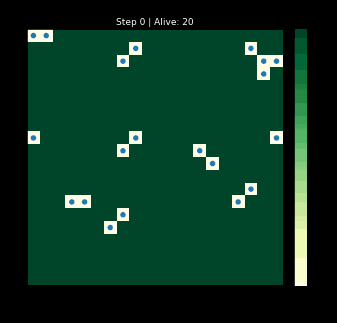
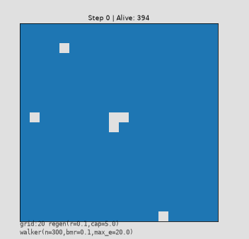
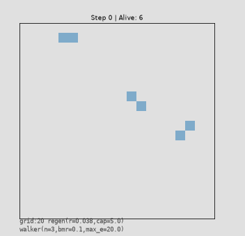
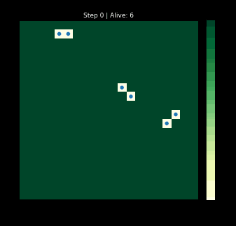
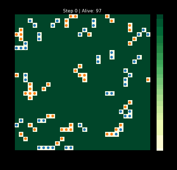

# Benchmark Suite

## Contents

- [Purpose](#purpose)
- [Calibration Benchmarks](#calibration-benchmarks)
- [Convergence Benchmarks](#convergence-benchmarks)

## Purpose

Verifies the simulation produces correct aggregate behavior: given known inputs, observed outputs match analytically predicted values. Tests compare simulation output to predictions without inspecting internal state. A benchmark measures a quantity that depends on multiple subsystems interacting. If predictable from one function's source, it belongs in `tests/`.

**Prerequisites**: Integration tests pass (`tests/test_integration_mechanical.py`).

1. **Model-derived prediction** — computed from the simulation's rules, never curve-fit to output
2. **Convergent quantity** — equilibrium, asymptotic, or time-averaged (not transient snapshots)
3. **Adequate power** — 10% miscalibration in any subsystem must fail the test
4. **Minimal assumptions** — prefer exact predictions (conservation laws, algebraic identities) over approximations; bound errors when approximations are necessary

## Calibration Benchmarks

Single-agent dynamics where exact analytical predictions are available.

### B2a: Mean Lifespan

**What**: energy drain rate + affordability gate + death boundary

**Why**: With `move_cost > 0`, the affordability gate (§9 Phase 3) creates two regimes. While energy ≥ B, the blob randomly moves or idles (stochastic phase, average cost `E[c]` per step). Once energy drops below B, it can only idle at fixed cost M until death (deterministic phase). Expected lifespan sums the two phases, corrected for the random amount by which energy crosses the boundary (overshoot `E[R]`):

```text
E[tau] = (E_0 - B)/E[c] + B/M + E[R]*(1/E[c] - 1/M)
B = M + move_cost,  E[c] = M + (8/9)*move_cost,  E[R] = E[c²]/(2*E[c])
```

Note: `tau = 1000 - 5*n_moves` (algebraic identity for these parameters), so observed values are always multiples of 5.

**Setup**: Single walker on 20×20 `DecayEnvironment(initial_cell_energy=0.0)`. `base_metabolic=0.1`, `move_cost=0.5`, `initial_energy=100.0`, `max_energy=200.0`, reproduction disabled. 50 trials. Predicted `E[tau]=186.16`.

**Pass**: `|observed_mean - predicted| < 3.0`

## Convergence Benchmarks

Population-level dynamics where stable-state behavior is predictable from first principles. These test multi-component interactions that calibration benchmarks don't reach: reproduction, spatial exclusion, environment regeneration, and crowding feedback.

### SC-1: Guaranteed Extinction (Decay Environment)



**What**: finite energy implies extinction — conservation law + metabolism + death + reproduction (reproduction redistributes but cannot create energy)

**Why**: With `E_injected=0`, each alive blob dissipates `>= base_metabolic_cost` per step. `E_dissipated` is monotonically non-decreasing, total energy finite. Therefore extinction is guaranteed within `T_max = ceil(E_initial / min_base_metabolic_cost)` steps. This holds regardless of reproduction — offspring receive energy from parents, so reproduction cannot create energy.

**Setup**: 20×20 `DecayEnvironment(initial_cell_energy=2.0)`, 5 walkers + 5 grazers. `base_metabolic=0.1`, `move_cost=0.2`, `reproduction_threshold=1.0`, `offspring_energy=0.5`. Zero energy injection. 10 trials, `E_initial = 810.0`, `T_max = 8100`.

**Pass**:

1. All trials reach `n_alive == 0` within T_max
2. Conservation holds at terminus (`|residual| < 1e-9`)

### SC-4: Reproduction then Extinction



**What**: population explosion + crash dynamics under energy conservation — reproduction drives growth, finite energy drives extinction, conservation holds through the entire lifecycle

**Why**: Same energy argument as SC-1, but rich grid energy (`initial_cell_energy=10.0` on 30x30 = 9000 total grid energy) creates a population boom before the inevitable crash. High metabolic cost (`base_metabolic_cost=0.4`, 4x IC-2) accelerates the drain — each alive blob dissipates at least 0.4/step, driving fast extinction. Reproduction redistributes energy among offspring but the system total `E_blobs + E_grid + E_dissipated` is invariant at every step.

Energy bound on population: at any instant, each alive blob has energy `> 0`, so `peak_population * offspring_energy <= E_initial`.

**Boom-bust dynamics**: When reproduction rate >> regeneration rate: overshoot → depletion → die-off → recovery → repeat. Whether convergence is monotone or oscillatory depends on the feedback loop gain. At high density, more actions target occupied cells and fail (§9 Phase 5), paying full cost with zero benefit — failure probability ≈ N/G², so this penalty grows quadratically with N, amplifying the crash.

**Setup**: 30×30 `DecayEnvironment(initial_cell_energy=10.0)`, 5 grazers. `base_metabolic_cost=0.4`, `reproduction_threshold=1.0`. Zero energy injection. 5 trials, `E_initial = 9005.0`, `pop_bound = 18010`.

**Pass**:

1. Peak population > initial count (reproduction happened)
2. All trials reach extinction
3. `peak_population <= E_initial / offspring_energy`
4. Conservation at every step (`max |residual| < 1e-9`)

### SC-5: Carrying Capacity Convergence

| Sparse start (10 blobs) | Dense start (300 blobs) |
|:---:|:---:|
|  |  |

**What**: crowding-regulated equilibrium — environment regeneration + metabolism + reproduction + death + spatial exclusion produce a stable population

**Why**: Mean-field energy balance at equilibrium. Energy input = energy dissipation:

```text
rate × (G² - N) = N × c_avg
N* ≈ rate × G² / (rate + c_avg)
```

With `rate=0.1`, `G²=400`, `c_avg = M + (8/9)*move_cost = 0.278`:

```text
N* ≈ 0.1 × 400 / (0.1 + 0.278) ≈ 106
```

**Approximation bounds**: Mean-field assumes well-mixed population. Spatial clustering means blobs deplete nearby cells, reducing absorption for their neighbors. Expect `N_observed < N*`; the 50% tolerance accommodates this. The full energy balance includes a death-remainder term `Φ_death`: `rate × (G² - N) = N × c_avg + Φ_death`; dropping it gives the simplified form above.

At high density, more actions target occupied cells and fail (§9 Phase 5), paying full cost with zero benefit. Failure probability ≈ N/G², so the crowding penalty grows quadratically with N — this is the negative feedback that stabilizes the equilibrium.

**Convergence test design**: Two runs from opposite extremes (10 sparse, 300 dense) must converge to similar equilibrium. This eliminates sensitivity to initial conditions and suggests the equilibrium is an attractor.

**Setup**: 20×20 `RegeneratingEnvironment(rate=0.1, capacity=5.0, initial_cell_energy=5.0)`, random walkers, reproduction enabled. 5 trials × 2 runs (sparse=10, dense=300), 2000 steps each.

**Pass**:

1. Mean population (last 200 steps) of sparse and dense runs within 30% of each other
2. Both means within 50% of analytical N*
3. Neither run goes extinct

### SC-6: Single Blob Energy Steady-State

**What**: energy absorption converges to expected rate — regeneration + absorption + metabolism reach equilibrium for a single agent

**Why**: Single blob on a 50x50 grid with `rate=1.0` (fast regeneration) and `capacity=5.0`. The blob moves randomly, visiting ~2500 unique positions before revisiting. Since `rate=1.0` and the grid is large, every cell the blob visits is at or near capacity. Net energy per step:

```text
absorbed - dissipated ≈ capacity - effective_cost = 5.0 - 0.278 = 4.722
```

Energy climbs rapidly to `max_energy=20.0` and stays there (capped).

**Setup**: 50×50 `RegeneratingEnvironment(rate=1.0, capacity=5.0, initial_cell_energy=5.0)`, 1 random walker, reproduction disabled. 10 trials, 500 steps.

**Pass**:

1. Blob alive at step 500
2. Mean energy (last 100 steps) within 1.0 of `max_energy` (20.0)
3. Energy variance (last 100 steps) < 1.0

### C2: Extinction Boundary (Phase Transition)

| Below r_c (extinction) | Above r_c (survival) |
|:---:|:---:|
|  |  |

**What**: extinction phase transition — below critical regeneration rate, populations go extinct; above it, they survive

**Why**: Single blob absorbs `a(r)` energy/step on a regenerating grid with rate `r`. Net surplus `s(r) = a(r) - c_avg`. When `s(r) < 0` → extinction; `s(r) > 0` → survival possible. Critical rate `r_c` where `a(r_c) = c_avg = 0.278`. In branching process terms: below `r_c`, mean offspring per parent `μ < 1` → certain extinction; above it, `μ > 1` → survival is possible. The critical rate is a phase transition.

**C2a calibration**: 3 walkers with reproduction on 20×20 grid, coarse sweep across 5 rates [0.03, 0.12]. 3 trials per rate, 500 steps. Interpolate P(survival) = 0.5 to find `r_c`.

**Setup**: IC-7, 3 rate multipliers of `r_c` (0.5×, 1.0×, 2.0×), 8 trials per rate, 500 steps.

**Pass**:

1. At 0.5 × r_c: P(survival) < 30%
2. At 2.0 × r_c: P(survival) > 70%

### C3: Strategy Dominance



**What**: strategy dominance — energy-seeking grazers outcompete undirected random walkers through higher per-blob absorption

**Why**: Grazers seek highest-energy neighboring cells → higher per-blob absorption than undirected random walkers. With identical metabolism, higher absorption → faster reproduction → eventual dominance. Mean-field predicts complete displacement when `Δ_absorb > 0`.

**C3a calibration**: Single grazer vs single walker (separate runs) on 30×30 regenerating grid (rate=0.1). 5 trials × 500 steps. Go/no-go gate: if `|Δ_absorb| < 0.01`, skip main (pass).

**Setup**: IC-9, 5 trials, 500 steps.

**Pass** (if go/no-go passes):

1. Dominant species (higher C3a absorption) reaches >70% of population in ≥4/5 trials
2. Dominant species alive at end of all trials
3. Frequency trend increasing over last 1000 steps (smoothed, ≤2 dips)
